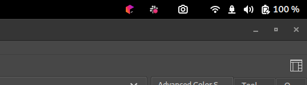
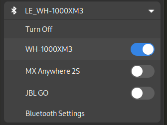

# Gnome tweaks for a better user experience

This document describes some configuration tweaks to make Gnome, in my opinion,
a bit more pleasant to use.

## Alt-Tab behaviour

By default, Alt-Tab in Gnome switches between groups of windows. For example,
separate browser windows are a single group. There is another shortcut for
switching within the group, making it really cumbersome to switch to a specific
browser window.

Often most common use cases for separate windows of the same application are
browser and terminal windows.

In these cases you have those separate windows to clearly separate between
different tasks. For that reason grouping those windows as one makes no sense.

To restore a more traditional Alt-Tab behaviour:

```
gsettings set org.gnome.desktop.wm.keybindings switch-windows "['<Alt>Tab']"
gsettings set org.gnome.desktop.wm.keybindings switch-applications "['<Super>Tab']"
gsettings set org.gnome.desktop.wm.keybindings switch-windows-backward "['<Shift><Alt>Tab']"
gsettings set org.gnome.desktop.wm.keybindings switch-applications-backward "['<Shift><Super>Tab']"
```

To revert those settings back to the originals:
```
gsettings set org.gnome.desktop.wm.keybindings switch-windows "[]"
gsettings set org.gnome.desktop.wm.keybindings switch-applications "['<Super>Tab', '<Alt>Tab']"
gsettings set org.gnome.desktop.wm.keybindings switch-windows-backward "[]"
gsettings set org.gnome.desktop.wm.keybindings switch-applications-backward "['<Shift><Super>Tab', '<Shift><Alt>Tab']"
```

Video clips demonstrating the gnome vs traditional behaviour:

https://user-images.githubusercontent.com/631441/188605103-57566d00-6d08-4749-b62b-381079edf227.mp4

https://user-images.githubusercontent.com/631441/188605257-5ed5bd7e-8212-4db2-862d-fdba3114fac4.mp4

## Extensions

### Application and KStatusNotifierItem Support

Status icon required by many applications. Disabled by default, probably
because Gnome wants to move away from applications using such icons. But
applications still use such icons, so there we are.



### [ArcMenu](https://extensions.gnome.org/extension/3628/arcmenu/)

The default method of opening or searching for applications is to open the
activities view, which is a full screen animation, and can be very
distracting.

[ArcMenu](https://extensions.gnome.org/extension/3628/arcmenu/) provides a more traditional Application menu with search capability,
and lets you tone down the visual distraction.

Other extensions are available too with similar features.

Video clips demonstrating Gnome vs ArcMenu:

https://user-images.githubusercontent.com/631441/188605489-be6c16b9-5454-46b3-adc7-42a386cfe126.mp4

https://user-images.githubusercontent.com/631441/188605513-f9993f23-5961-419a-959b-0288d1b4b9d8.mp4

### Bluetooth Quick Connect

To connect to a bluetooth device, such as headphones, requires you to open the
Bluetooth settings window. If you have to do this often, this extension lets
you do it right from the panel with less clicks.



### Notification Timeout

In Gnome, notifications never go away unless you move the mouse or hit some
keys. This can be very annoying if you're not actively working on the
computer, but are watching the screen.

With the [Notification Timeout](https://extensions.gnome.org/extension/3795/notification-timeout/) extension the notification will disappear after
a timeout, bringing the behaviour closer to most other desktop
environments out there.

### [Just Perfection](https://extensions.gnome.org/extension/3843/just-perfection/)

A collection of settings. I use it for:
* remove the annoying "Window is ready" notification
* set Startup Status to "Desktop" instead of "Overview"
* change the Notification Banner Position to "Top End" to make it less distracting.

## File manager text search behaviour

Normally when you type something in Files (nautilus), it will perform a
recursive search in all subfolders.

You may prefer to only filter the files in the current directory. This will
bring the behaviour closer to all other file managers, where you can at least
jump to a file starting with a specific letter.

```
gsettings set org.gnome.nautilus.preferences recursive-search 'never'
```

(This setting is also available in the Nautilus preferences window)

## Things to figure out

There are some annoyances I haven't found fixes for.

### Suspending soon because of inactivity

This popup appears at some point, suggesting that the computer will suspend
soon. It will however, not suspend soon, and the annoying popup just uselessly
sits there.

## Other nice-to-haves

Gnome allows moving windows with win+left click, but for some reason has
disabled the ability to resize windows with win+right click. This setting
enables that behaviour.

```
gsettings set org.gnome.desktop.wm.preferences resize-with-right-button true
```
