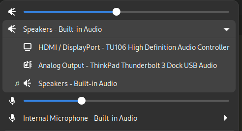

# Gnome tweaks for a better user experience

This document describes some configuration tweaks to make Gnome, in my opinion,
a bit more pleasant to use.

## Alt-Tab behaviour

By default, Alt-Tab in Gnome switches between groups of windows. For example,
separate browser windows are a single group. There is another shortcut for
switching within the group, making it really cumbersome to switch to a specific
window.

Often most common use cases for separate windows of the same application are
browser and terminal windows.

In those cases you have the separate windows to clearly separate between
different tasks. For that reason grouping those windows as one often makes no
sense.

To restore a more traditional Alt-Tab behaviour:

```
gsettings set org.gnome.desktop.wm.keybindings switch-windows "['<Alt>Tab']"
gsettings set org.gnome.desktop.wm.keybindings switch-applications "['<Super>Tab']"
gsettings set org.gnome.desktop.wm.keybindings switch-windows-backward "['<Shift><Alt>Tab']"
gsettings set org.gnome.desktop.wm.keybindings switch-applications-backward "['<Shift><Super>Tab']"
```

To revert those settings back to the originals:
```
gsettings set org.gnome.desktop.wm.keybindings switch-windows "[]"
gsettings set org.gnome.desktop.wm.keybindings switch-applications "['<Super>Tab', '<Alt>Tab']"
gsettings set org.gnome.desktop.wm.keybindings switch-windows-backward "[]"
gsettings set org.gnome.desktop.wm.keybindings switch-applications-backward "['<Shift><Super>Tab', '<Shift><Alt>Tab']"
```

(These shortcuts can also be changed from the Settings application)

Video clips demonstrating the gnome vs traditional behaviour:

https://user-images.githubusercontent.com/631441/188605103-57566d00-6d08-4749-b62b-381079edf227.mp4

https://user-images.githubusercontent.com/631441/188605257-5ed5bd7e-8212-4db2-862d-fdba3114fac4.mp4

## Minimize & Maximize buttons

Gnome has removed the minimize and maximize buttons from window titles by default.


The maximize button has been removed in favor of double-clicking the taskbar.

There's a couple of reasonings for removing the minimize button, as far as I know:
* There's nothing to minimize to - Gnome has no taskbar or a dock, so users may be confused
* The idea in Gnome is that all windows are always visible, and there's no need to minimize them. Instead of minimizing windows, use the available screen estate, as well as workspaces

To me, this idea does not work.

* I know where minimized windows go - they go out of my sight, and I can access them via Alt-Tab
* By organizing windows only using the available screen estate, my windows would be too small, and I would have to shuffle through 10 workspaces

So, for my own convenience, I add the minimize & maximize buttons back:


```
gsettings set org.gnome.desktop.wm.preferences button-layout 'appmenu:minimize,maximize,close'
```

To revert back to defaults (no minimize & maximize):

```
gsettings set org.gnome.desktop.wm.preferences button-layout 'appmenu:close'
```

## Extensions

### [AppIndicator and KStatusNotifierItem Support](https://extensions.gnome.org/extension/615/appindicator-support/)

Status icon required by many applications. Disabled by default, probably
because Gnome wants to move away from applications using such icons. But
applications still use such icons, so there we are.


### [ArcMenu](https://extensions.gnome.org/extension/3628/arcmenu/)

The default method of opening or searching for applications is to open the
activities view, which is a full screen animation, and can be very
distracting.

[ArcMenu](https://extensions.gnome.org/extension/3628/arcmenu/) provides a more
traditional Application menu with search capability, and lets you tone down the
visual distraction.

Other extensions are available too with similar features, and the main goal for
me is to just avoid the jarring feeling of the full screen view.

Video clips demonstrating Gnome vs ArcMenu:

https://user-images.githubusercontent.com/631441/188605489-be6c16b9-5454-46b3-adc7-42a386cfe126.mp4

https://user-images.githubusercontent.com/631441/188605513-f9993f23-5961-419a-959b-0288d1b4b9d8.mp4

### [Sound Input & Output Device Chooser](https://extensions.gnome.org/extension/906/sound-output-device-chooser/)

This extension adds the ability to easily change the active sound device, without having to go through the Settings. Very useful
if you have more than more output device - which is very common.

This should be a built-in feature, and future versions of gnome are rumored to
add something like it. Meanwhile this extension will do the trick.



### [Bluetooth Quick Connect](https://extensions.gnome.org/extension/1401/bluetooth-quick-connect/)

To connect to a bluetooth device, such as headphones, requires you to open the
Bluetooth settings window. If you have to do this often, this extension lets
you do it right from the panel with less clicks.


### [Notification Timeout](https://extensions.gnome.org/extension/3795/notification-timeout/)

In Gnome, notifications never go away unless you move the mouse or hit some
keys. This can be very annoying if you're not actively working on the computer,
but are watching the screen.

With the [Notification
Timeout](https://extensions.gnome.org/extension/3795/notification-timeout/)
extension the notification will disappear after a timeout, bringing the
behaviour closer to most other desktop environments out there.

### [Just Perfection](https://extensions.gnome.org/extension/3843/just-perfection/)

A collection of settings. I use it for:
* remove the annoying "Window is ready" notification
* set Startup Status to "Desktop" instead of "Overview"
* change the Notification Banner Position to "Top End" to make it less distracting.

## File manager text search behaviour

Normally when you type something in Files (nautilus), it will perform a
recursive search in all subfolders.

You may prefer to only filter the files in the current directory. This will
bring the behaviour closer to all other file managers, where you can at least
jump to a file starting with a specific letter.

```
gsettings set org.gnome.nautilus.preferences recursive-search 'never'
```

(This setting is also available in the Nautilus preferences window)

## Other nice-to-haves

### Resizing windows

Gnome allows moving windows with win+left click, and resize them with
win+middle click.

I prefer resizing with win+right click, since the wheel
button on mice is usually not very nice to press. Also I've simply gotten used
to win+right click from other window managers.

This setting will change resize to win+right click.

```
gsettings set org.gnome.desktop.wm.preferences resize-with-right-button true
```

### Scrollbar width

The prevailing UI trend today is to have extremely narrow scrollbars. The
reasoning behind this appears to be that scrolling is better achieved using
hardware solutions such as scrollwheel or touch scrolling.

For this reason, UI designers have decided to make the scrollbar extremly
small, assuming that nobody uses them for actual scrolling.

However, in practice the scrollbar is still the best way to jump-scroll to
different parts of the scrollable area, and no common hardware solutions
achieve this yet in a way that is pleasant to use.

For this reason, I choose to make my scrollbars bigger, so I don't have to
stress myself trying to click a scrollbar only a few pixels wide.

https://user-images.githubusercontent.com/631441/188924176-3821a11d-ba58-4919-a258-03c173cb27dc.mp4

On Gnome, this requires a CSS hack, stored in both `~/.config/gtk-3.0/gtk.css`
and `~/.config/gtk-4.0/gtk.css`:

```css
scrollbar slider {
    /* Size of the slider */
    border-radius: 22px;

    /* Padding around the slider */
    border: 5px solid transparent;
    min-width: 18px;
    min-height: 18px;
}
```

On firefox, scrollbar width can be changed in `about:config`:

`widget.non-native-theme.scrollbar.size.override` → `22`

# Things to figure out

There are some annoyances I haven't found fixes for.

## Suspending soon because of inactivity

This popup appears at some point, suggesting that the computer will suspend
soon. It will however, not suspend soon, and the annoying popup just uselessly
sits there.
